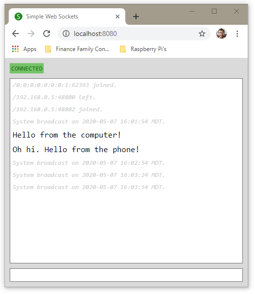

# simple-web-socket

simple-web-socket is a web application meant to illustrate a basic web socket setup.  Some of what's illustrated:
* Web socket communication between client and server
* Multiple message types
* Scheduled system broadcasts via the "@Scheduled" method annotation



## Usage

Clone the repository and execute the following.  Runs on port 8080.

```
./gradlew bootRun
```

## License
[MIT](https://choosealicense.com/licenses/mit/)